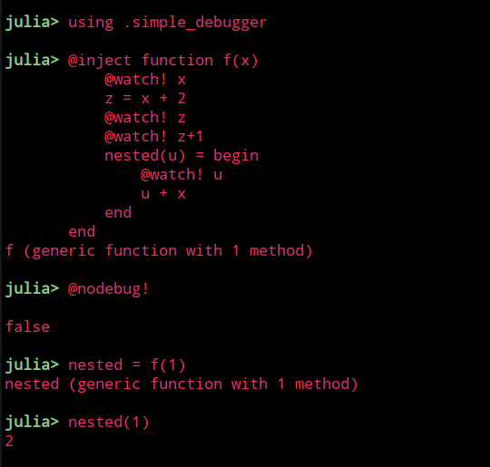
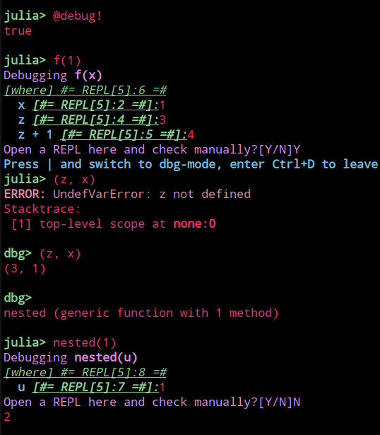

# MLStyle Playground


## Simple Debugger in 200 lines

A clean implementation.

Requirements except MLStyle.jl:
- https://github.com/thautwarm/ReplMaker.jl
- Crayons.jl
- PrettyPrinting.jl
- REPL




## For-patterns

Story: https://github.com/thautwarm/MLStyle.jl/issues/51

Yet another useful derivative from the idea: **deconstruct data just as how they're constructed**.

```julia

include("for-patterns.jl")
x = [1, 2, 3]

seq = @match x begin
    [i for (i, i + 1) in seq] => seq
end

print(seq)
# [(1, 2), (2, 3), (3, 4)]


@active Symbol(x) begin Symbol(x) end
@active Eval(x) begin eval(Meta.parse(x)) end


x = [("x", "2 + 3"), ("y", "3 + 4"), ("z", "4 + 5")]

@match x begin
    [(Symbol(fst), Eval(snd)) for (fst, snd)
      in (seq && [(x, 5), _...])] =>  (seq, x)
end

# ([(:x, 5), (:y, 7), (:z, 9)], :x)
```

It'll be added into MLStyle master sooner.


## Julia Is A Lisp Idiom

```julia
include("lisp.jl")
@info @lisp [
   :block
   [:function [f x] [(+) x 1]]
   [f 2]
]
```
produces
```julia
[ Info: 3
```

Also,
```julia
julia> @lisp [:(=) [f a b] [(+) 2a b]]
f (generic function with 1 method)

julia> @lisp [f 1 2]
4
```

## Syntax Extension Prototype

```julia
include("allow_patterns.jl")
    @allow_patterns module SyntaxExtended
        case(1) do
            2        => error(1)
            5:10     => error(2)
            1:4 && a =>
            case(a + 1) do
                a => 5a
            end
        end |> println
    end
```
produces
```julia
10
Main.SyntaxExtended
```

## Statically Capturing

This is similar to `@capture` in MacroTools.jl but much more powerful and efficient.

```julia

@info @capture f($x) :(f(1))
# Dict(:x=>1)

destruct_fn = @capture function $(fname :: Symbol)(a, $(args...)) $(body...) end

@info destruct_fn(:(
    function f(a, x, y, z)
        x + y + z
    end
))

# Dict{Symbol,Any}(
#     :args => Any[:x, :y, :z],
#     :body=> Any[:(#= StaticallyCapturing.jl:93 =#), :(x + y + z)],
#    :fname=>:f
# )

```

## MQuery

The codes of [Write You A Query Language](https://github.com/thautwarm/MLStyle.jl/blob/tutorial-MQuery/docs/src/tutorials/query-lang.md).

Not like other similar implementations, `MQuery.jl` just depends on fewer packages like `DataStructures.jl` and `MLStyle.jl`.

```julia
include("MQuery/MQuery.jl")
using Base.Enums
@enum TypeChecking Dynamic Static
df = DataFrame(
        Symbol("Type checking") => [
            Dynamic, Static, Static, Dynamic, Static, Dynamic, Dynamic, Static
        ],
        :name => [
            "Julia", "C#", "F#", "Ruby", "Java", "JavaScript", "Python", "Haskell"
        ],
        :year => [
            2012, 2000, 2005, 1995, 1995, 1995, 1990, 1990
        ]
)

df |>
@where !startswith(_.name, "Java"),
@groupby _."Type checking" => TC, endswith(_.name, "#") => is_sharp,
@having TC === Dynamic || is_sharp,
@select join(_.name, " and ") => result, _.TC => TC

# 2×2 DataFrame
# │ Row │ result                    │ TC        │
# │     │ String                    │ TypeChec… │
# ├─────┼───────────────────────────┼───────────┤
# │ 1   │ Julia and Ruby and Python │ Dynamic   │
# │ 2   │ C# and F#                 │ Static    │
```

## Linq

Check [Linq.jl](./Linq.jl).

```julia

import .Linq: dispatch

dispatch(::Val{:str}, arr :: Vector{T}) where T = string(arr)

dispatch(::Val{:println}, s :: String) where T = println(s)

@linq [1, 2, 3].map(x -> 2x).str.println

# [2, 4, 6]
```

## Cond

Check [Cond.jl](./Cond.jl)

```julia
@cond begin
    x == 1         => :case1
    x < 2 && x > 3 => :case2
    _              => :case3
end
```

## Active Patterns

Active Patterns can help you with making custom patterns.

```julia

red = RGB(220, 20, 60)
@match red begin
    Green(which_green) => throw("red is taken as $which_green")
    Red(which_red) => which_red
    _ => throw("red is not recognized!")
end

```
